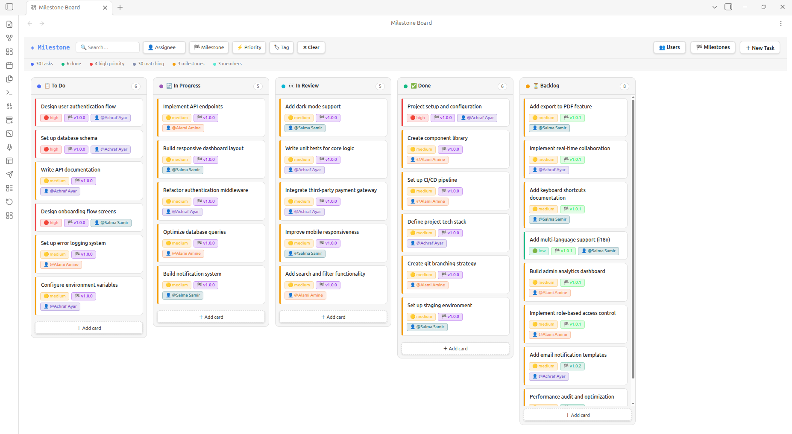
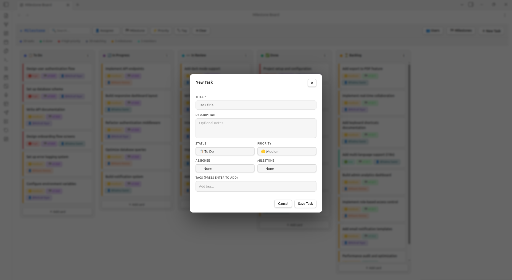
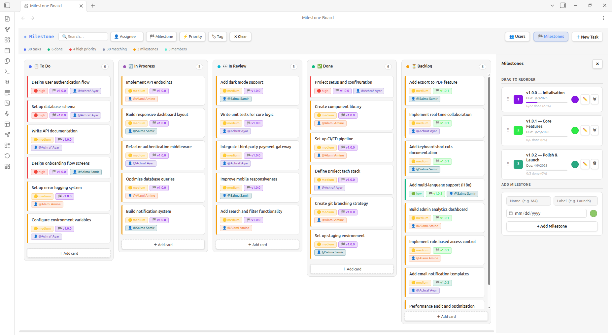
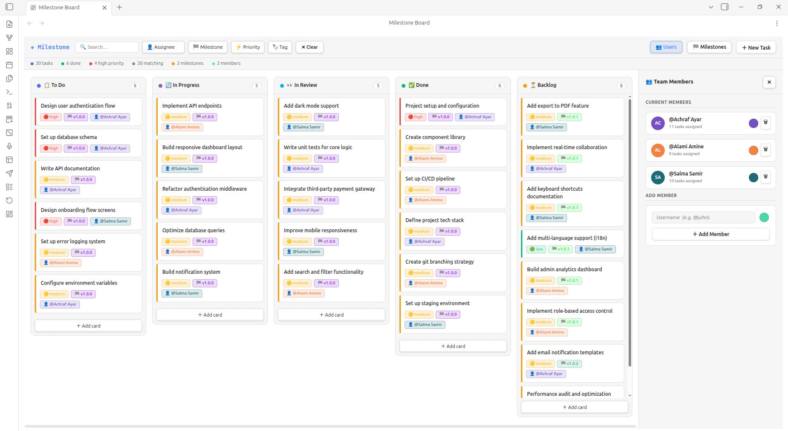

# Milestone — Obsidian Kanban Board

A full-featured Kanban board built for teams that live in Obsidian.  
Manage tasks, team members, and milestones — all stored as a single JSON file that syncs seamlessly via Git or Obsidian Sync.

---

## Screenshots

### Kanban Board View


### Task Creation Modal


### Milestones Panel


### Team Members Panel


---

## Features

- **Kanban board** with drag-and-drop between columns
- **Filter bar** — filter by assignee, milestone, priority, and tag in real time
- **Team members panel** — add/remove members, pick colours, track task counts
- **Milestones panel** — create milestones with labels, due dates, progress bars, and drag-to-reorder
- **Task modal** — create and edit tasks with title, description, status, priority, assignee, milestone, and tags
- **Vault-native storage** — all data lives in a single `.json` file, perfect for Git/Sync sharing

---

## Installation

### From the Community Plugin List

1. Open **Settings → Community Plugins → Browse**
2. Search for **Milestone**
3. Click **Install**, then **Enable**

### Manual Installation

1. Download `main.js` and `manifest.json` from the latest [release](../../releases)
2. Place them in `<vault>/.obsidian/plugins/milestone-board/`
3. Reload Obsidian and enable the plugin under **Community Plugins**

---

## Usage

Open the board using any of these methods:
- Press **Ctrl+M** (or **Cmd+M** on Mac)
- Click the **dashboard icon** in the ribbon
- Run **"Open Milestone Board"** from the command palette

| Action             | How                                                       |
| ------------------ | --------------------------------------------------------- |
| New task           | Click **＋ New Task** or **＋ Add card** under any column |
| Edit task          | Hover a card → click ✏️                                   |
| Delete task        | Hover a card → click 🗑                                   |
| Move task          | Drag card to another column                               |
| Filter             | Use the dropdowns in the top bar                          |
| Manage users       | Click **👥 Users** in the top bar                         |
| Manage milestones  | Click **🏁 Milestones** in the top bar                    |
| Reorder milestones | Drag rows in the Milestones panel                         |
| Quick create       | Select **"➕ Create new..."** from assignee/milestone dropdowns in task modal |

---

## Data & Sync

All board data is stored at `milestone-board.json` in your vault root.  
You can change the path under **Settings → Milestone Board**.

Since it is a plain JSON file, it works perfectly with:

- **Obsidian Sync**
- **Git** (each team member's filter state is local; task data is shared)

---

## Development

```bash
# Install dependencies
npm install

# Build for development (with source maps)
npm run dev

# Build for production
npm run build
```

Source is organised by domain:

```
src/
  main.ts              # Plugin entry point
  BoardView.ts         # Root view — orchestrates everything
  SettingsTab.ts       # Obsidian settings UI
  constants.ts         # Default data and settings
  types.ts             # TypeScript interfaces
  styles.ts            # All CSS in one place
  components/
    Card.ts            # Single task card
    Column.ts          # Board column
    TagInput.ts        # Reusable pill tag input
  modals/
    TaskModal.ts       # Create / edit task
    MilestoneEditModal.ts  # Edit milestone details
  panels/
    UsersPanel.ts      # Team members side panel
    MilestonesPanel.ts # Milestones side panel
  utils/
    DataStore.ts       # Vault read / write
    filters.ts         # Filter matching logic
    dom.ts             # DOM helper functions
    uid.ts             # Unique ID generator
```

---

## License

MIT
